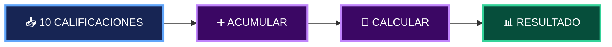
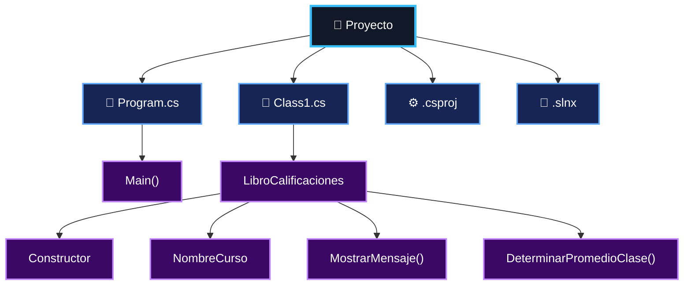
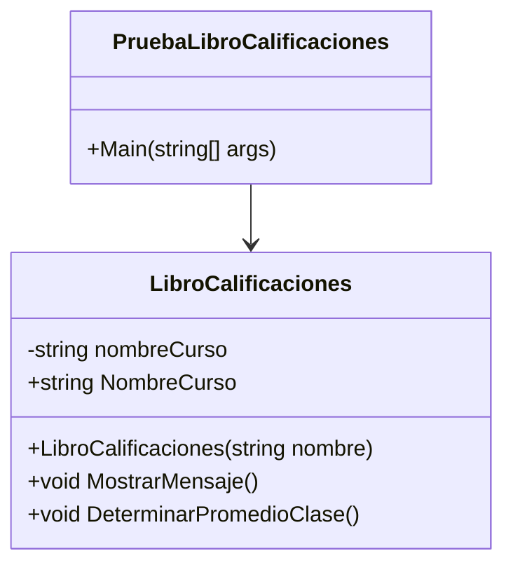
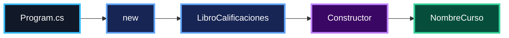
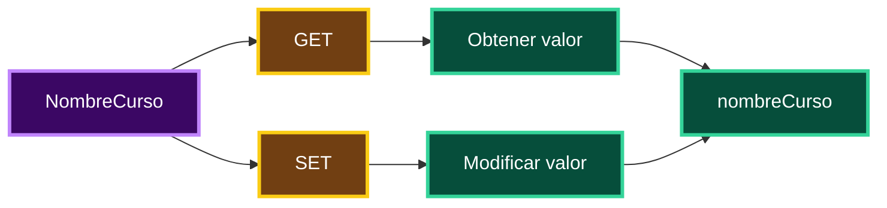
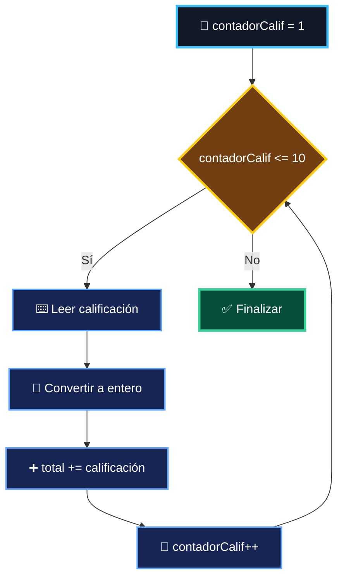
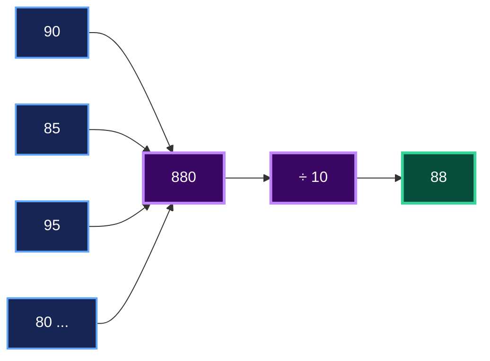
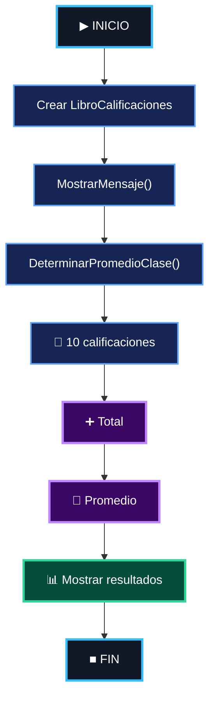

<div align="center">

# ACTIVIDAD — LIBRETA DE CALIFICACIONES EN C#

### C# · .NET · Clases · Objetos · Ciclo `while` · Consola

<br>


<br><br>

**Victor Montes**
**Universidad Tecnológica de Panamá — UTP**
**Facultad de Ingeniería de Sistemas Computacionales — FISC**

<br>


<br>

**Fecha:** 15/09/2026

</div>

---

## 1. Información de la Actividad

<div align="center">

|                    |                                  |
| ------------------ | -------------------------------- |
| **Actividad**   | Libreta de Calificaciones        |
| **Lenguaje**    | C#                               |
| **Plataforma**  | .NET 10                          |
| **Aplicación** | Consola                          |
| **Estructura**  | `while`                          |
| **Paradigma**   | Programación Orientada a Objetos |
| **Autor**    | Victor Montes                    |
| **Institución** | UTP — FISC                       |

</div>

---

## 2. Contenido del Repositorio

<div align="center">

<table>
<tr>

<td align="center">


**C#**

</td>

<td align="center">


**.NET**

</td>

<td align="center">


**CLASES**

</td>

<td align="center">


**OBJETOS**

</td>

<td align="center">


**WHILE**

</td>

<td align="center">


**PROMEDIO**

</td>

</tr>
</table>

</div>

La actividad desarrolla una aplicación de consola para registrar **10 calificaciones**, calcular su total y obtener el promedio de la clase.



---

## 3. Tecnologías Utilizadas

<div align="center">

<table>
<tr>

<td align="center" width="150">


<br>

**C#**

</td>

<td align="center" width="150">


<br>

**.NET**

</td>

<td align="center" width="150">


<br>

**Visual Studio**

</td>

<td align="center" width="150">


<br>

**Git**

</td>

<td align="center" width="150">


<br>

**GitHub**

</td>

</tr>
</table>

</div>

---

## 4. Estructura del Proyecto

```text
Actividad-C-SHARP-Libreta-de-Calificaciones-Hojas-Impresas/
│
└── Codigo#1 - Victor Montes/
    │
    ├── Codigo#1 - Victor Montes.slnx
    │
    └── Codigo#1 - Victor Montes/
        │
        ├── Program.cs
        ├── Class1.cs
        └── Codigo#1 - Victor Montes.csproj
```



---

## 5. Clase `LibroCalificaciones`



<div align="center">

| 🧩 Elemento                 | ⚙️ Función                   |
| --------------------------- | ---------------------------- |
| `nombreCurso`               | Almacena el nombre del curso |
| `NombreCurso`               | Propiedad `get / set`        |
| Constructor                 | Inicializa el curso          |
| `MostrarMensaje()`          | Muestra bienvenida           |
| `DeterminarPromedioClase()` | Procesa las calificaciones   |

</div>

---

## 6. Creación del Objeto



```csharp
LibroCalificaciones miLibroCalificaciones =
    new LibroCalificaciones(
        "CS101 Introducción a la programación en C#"
    );
```

---

## 7. Propiedad `NombreCurso`



```csharp
public string NombreCurso
{
    get
    {
        return nombreCurso;
    }

    set
    {
        nombreCurso = value;
    }
}
```

---

## 8. Registro de Calificaciones



```csharp
while (contadorCalif <= 10)
{
    Console.Write("Escriba calificación: ");

    calificacion =
        Convert.ToInt32(Console.ReadLine());

    total = total + calificacion;

    contadorCalif = contadorCalif + 1;
}
```

---

## 9. Cálculo del Promedio

<div align="center">

<table>
<tr>

<td align="center">

### 📥 ENTRADA

**10 calificaciones**

</td>

<td align="center">

### ➕

**Acumulación**

</td>

<td align="center">

### 🧮

**Total ÷ 10**

</td>

<td align="center">

### 📊 SALIDA

**Promedio**

</td>

</tr>
</table>

</div>

```csharp
promedio = total / 10;
```



---

## 10. Flujo de la Aplicación



---

## 11. Capturas de Pantalla

### Ejecución

<div align="center">


</div>

### Ingreso de Calificaciones

<div align="center">


</div>

### Resultado

<div align="center">


</div>

---

## 12. Salida del Programa

```text
Bienvenido al libro de calificaciones de
CS101 Introducción a la programación en C#!

Escriba calificación: 90
Escriba calificación: 85
Escriba calificación: 95
Escriba calificación: 80
Escriba calificación: 88
Escriba calificación: 92
Escriba calificación: 75
Escriba calificación: 89
Escriba calificación: 100
Escriba calificación: 86

El total de las 10 calificaciones es 880
El promedio de la clase es 88
```

---

## 13. Conceptos Aplicados

<div align="center">

| 🧩  | Concepto    | 🧩 | Concepto        |
| --- | ----------- | -- | --------------- |
| 📦  | Clase       | 🧍 | Objeto          |
| 🏗️ | Constructor | 🔐 | Encapsulamiento |
| ⚙️  | Métodos     | 🔄 | `while`         |
| 📥  | Entrada     | 📤 | Salida          |
| ➕   | Acumulador  | 🔢 | Contador        |
| 🧮  | Promedio    | 🔠 | Conversión      |

</div>

---

## 14. Ejecución

### Visual Studio

```text
Abrir solución
      ↓
Codigo#1 - Victor Montes.slnx
      ↓
Ejecutar ▶
      ↓
Ingresar 10 calificaciones
      ↓
Ver resultado
```

### Terminal

```bash
dotnet run
```

---

## 15. Autor y Contexto

<div align="center">


<br><br>

**Universidad Tecnológica de Panamá — UTP**

**Facultad de Ingeniería de Sistemas Computacionales — FISC**

**Ingeniería en Sistemas y Computación**

<br>

**15/09/2026**

</div>

---

## 16. Referencias

<div align="center">

[](https://learn.microsoft.com/en-us/dotnet/csharp/)
[](https://learn.microsoft.com/en-us/dotnet/)
[](https://learn.microsoft.com/en-us/visualstudio/)

</div>

---

<div align="center">

### C# · .NET · POO · Consola

<br>

**Victor Montes**

**Universidad Tecnológica de Panamá**

</div>
