<div align="center">

# ACTIVIDAD — LIBRETA DE CALIFICACIONES EN C#

### C# · .NET · Clases · Objetos · Ciclo `while` · Consola

<br>

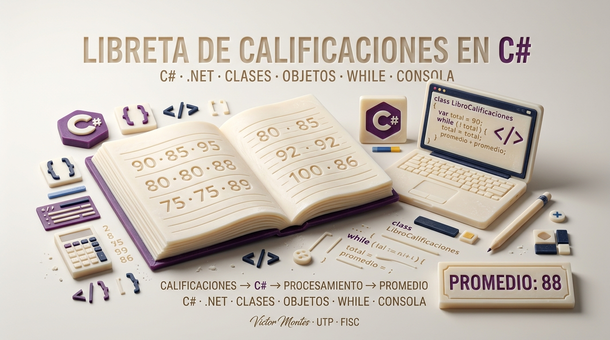

<br><br>

**Victor Montes**
**Universidad Tecnológica de Panamá — UTP**
**Facultad de Ingeniería de Sistemas Computacionales — FISC**

<br>


<br>

**Fecha:** 15/09/2026

</div>

---

## 1. Información de la Actividad

<div align="center">

|                 |                                  |
| --------------- | -------------------------------- |
| **Actividad**   | Libreta de Calificaciones        |
| **Lenguaje**    | C#                               |
| **Plataforma**  | .NET 10                          |
| **Aplicación**  | Consola                          |
| **Estructura**  | `while`                          |
| **Paradigma**   | Programación Orientada a Objetos |
| **Autor**       | Victor Montes                    |
| **Institución** | UTP — FISC                       |

</div>

---

## 2. Descripción

Esta actividad consiste en desarrollar programas de consola en **C#** utilizando los fundamentos de la **Programación Orientada a Objetos**, clases, objetos, propiedades, métodos y estructuras de repetición.

El repositorio contiene **dos proyectos independientes** que resuelven el problema de una libreta de calificaciones mediante dos estrategias diferentes:

### 🟦 Código #1 — Cantidad fija

El programa solicita exactamente **10 calificaciones**, las acumula y posteriormente calcula el promedio de la clase.

### 🟪 Código #2 — Cantidad variable

El programa permite introducir una cantidad **indefinida de calificaciones**. La entrada finaliza cuando el usuario introduce el valor **`-1`**, utilizado como valor centinela.

---

## 3. Proyectos de la Actividad

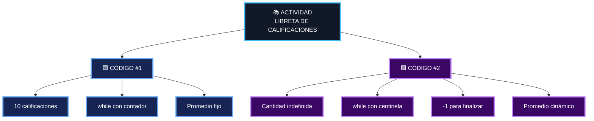

### Resumen

| Proyecto         | Entrada           | Control del ciclo | Finalización             |
| ---------------- | ----------------- | ----------------- | ------------------------ |
| 🟦 **Código #1** | 10 calificaciones | Contador          | Después de 10            |
| 🟪 **Código #2** | Cantidad variable | Centinela         | Cuando se introduce `-1` |

---

# 🟦 4. CÓDIGO #1 — Libreta de Calificaciones

## 4.1 Descripción

El primer proyecto desarrolla una aplicación de consola que solicita exactamente **10 calificaciones**.

El programa utiliza un contador para controlar el ciclo `while`.

```text
Inicio
   │
   ▼
contadorCalif = 1
   │
   ▼
¿contadorCalif <= 10?
   │
   ├── Sí ──► Leer calificación
   │             │
   │             ▼
   │          Acumular
   │             │
   │             ▼
   │        Incrementar contador
   │             │
   │             └──────────► Volver al while
   │
   └── No ──► Calcular promedio
                    │
                    ▼
                  Fin
```

---

## 4.2 Estructura del Proyecto

```text
Codigo#1 - Victor Montes/
│
├── Codigo#1 - Victor Montes.slnx
│
└── Codigo#1 - Victor Montes/
    │
    ├── Program.cs
    ├── Class1.cs
    └── Codigo#1 - Victor Montes.csproj
```

---

## 4.3 Clase `LibroCalificaciones`

La clase representa el libro de calificaciones y contiene:

| Elemento                    | Función                          |
| --------------------------- | -------------------------------- |
| `nombreCurso`               | Almacena el nombre del curso     |
| `NombreCurso`               | Propiedad `get / set`            |
| Constructor                 | Inicializa el curso              |
| `MostrarMensaje()`          | Muestra el mensaje de bienvenida |
| `DeterminarPromedioClase()` | Procesa las calificaciones       |

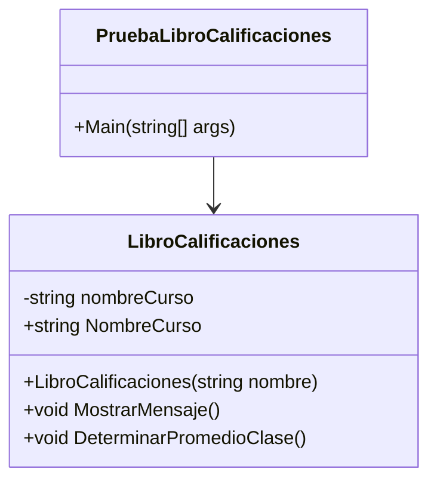

---

## 4.4 Creación del Objeto

```csharp
LibroCalificaciones miLibroCalificaciones =
    new LibroCalificaciones(
        "CS101 Introducción a la programación en C#"
    );
```

El objeto `miLibroCalificaciones` es una instancia de la clase `LibroCalificaciones`.

---

## 4.5 Registro de las 10 Calificaciones

El ciclo `while` continúa mientras el contador sea menor o igual a `10`.

```csharp
while (contadorCalif <= 10)
{
    Console.Write("Escriba calificación: ");

    calificacion =
        Convert.ToInt32(Console.ReadLine());

    total = total + calificacion;

    contadorCalif = contadorCalif + 1;
}
```

### Flujo

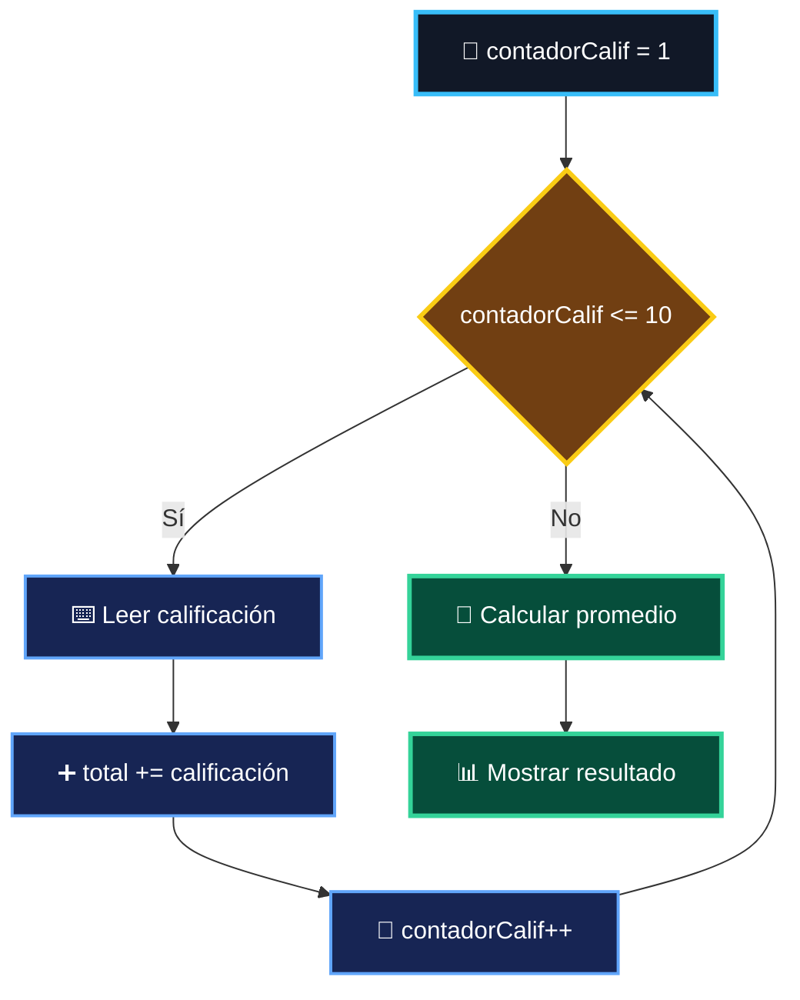

---

## 4.6 Cálculo del Promedio

Después de ingresar las 10 calificaciones:

```csharp
promedio = total / 10;
```

La operación corresponde a:

```text
Promedio = Total de calificaciones ÷ 10
```

---

## 4.7 Ejemplo de Ejecución

```text
Bienvenido al libro de calificaciones de
CS101 Introducción a la programación en C#!

Escriba calificación: 90
Escriba calificación: 85
Escriba calificación: 95
Escriba calificación: 80
Escriba calificación: 88
Escriba calificación: 92
Escriba calificación: 75
Escriba calificación: 89
Escriba calificación: 100
Escriba calificación: 86

El total de las 10 calificaciones es 880
El promedio de la clase es 88
```

---

# 🟪 5. CÓDIGO #2 — Libreta de Calificaciones con Centinela

## 5.1 Descripción

El segundo proyecto utiliza una estrategia diferente.

En lugar de establecer previamente que se introducirán 10 calificaciones, el programa permite ingresar **tantas calificaciones como sean necesarias**.

Para finalizar la entrada, el usuario debe introducir:

```text
-1
```

Este valor se conoce como **valor centinela**.

El `-1` no se suma al total ni se considera una calificación.

---

## 5.2 Estructura del Proyecto

```text
Codigo#2 - Victor Montes/
│
├── Codigo#2 - Victor Montes.slnx
│
└── Codigo#2 - Victor Montes/
    │
    ├── Program.cs
    ├── Class1.cs
    └── Codigo#2 - Victor Montes.csproj
```

---

## 5.3 Funcionamiento

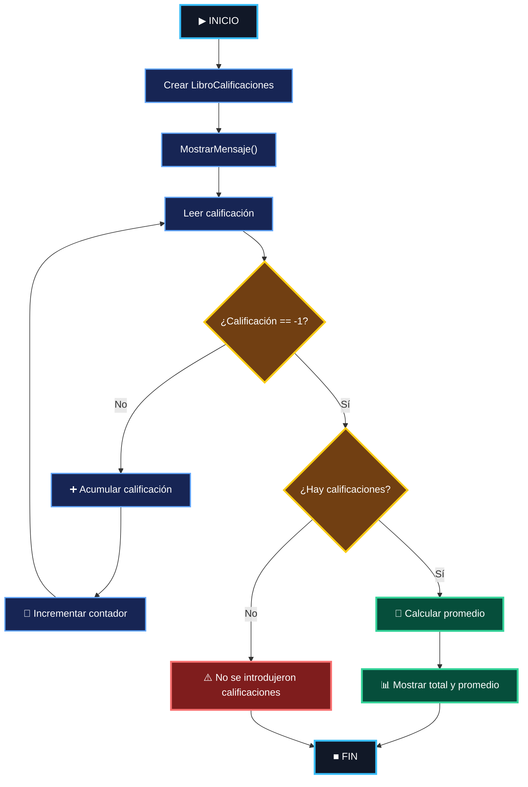

---

## 5.4 Método `DeterminaPromedioClase()`

El método permite introducir calificaciones hasta que el usuario introduzca `-1`.

```csharp
Console.Write("Escriba calificación o -1 para salir: ");
calificacion = Convert.ToInt32(Console.ReadLine());

while (calificacion != -1)
{
    total = total + calificacion;
    contadorCalif = contadorCalif + 1;

    Console.Write("Escriba calificación o -1 para salir: ");
    calificacion = Convert.ToInt32(Console.ReadLine());
}
```

La condición:

```csharp
while (calificacion != -1)
```

significa:

> "Continúa solicitando calificaciones mientras el usuario no introduzca `-1`."

---

## 5.5 Valor Centinela

El **centinela** es un valor especial utilizado para indicar que el usuario desea terminar la entrada de datos.

En este proyecto:

```text
-1
```

es el valor centinela.

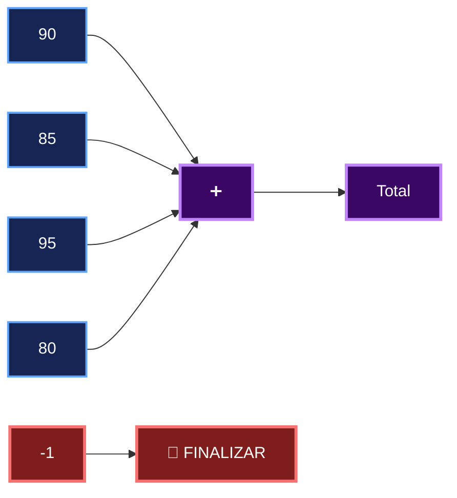

---

## 5.6 Cálculo del Promedio

A diferencia del Código #1, aquí el número de calificaciones no está establecido previamente.

Por eso el promedio se calcula utilizando el contador:

```csharp
promedio = (double)total / contadorCalif;
```

Por ejemplo:

```text
Calificaciones:

90
85
95
80
-1

Total = 350
Cantidad = 4

Promedio = 350 / 4

Promedio = 87.50
```

---

## 5.7 Validación

El programa también verifica que se haya introducido al menos una calificación.

```csharp
if (contadorCalif != 0)
{
    promedio = (double)total / contadorCalif;

    Console.WriteLine(
        "\nEl total de las {0} calificaciones introducidas es {1}",
        contadorCalif,
        total
    );

    Console.WriteLine(
        "El promedio de la clase es {0:F2}",
        promedio
    );
}
else
{
    Console.WriteLine(
        "No se introdujeron calificaciones."
    );
}
```

Esto evita realizar una división entre cero.

---

## 5.8 Ejemplo de Ejecución

```text
Bienvenido al libro de calificaciones para
CS101 Introducción a la programación en C#!

Escriba calificación o -1 para salir: 90
Escriba calificación o -1 para salir: 85
Escriba calificación o -1 para salir: 95
Escriba calificación o -1 para salir: 80
Escriba calificación o -1 para salir: 88
Escriba calificación o -1 para salir: -1

El total de las 5 calificaciones introducidas es 438
El promedio de la clase es 87.60
```

---

# 6. Comparación de los Dos Proyectos

Los dos proyectos resuelven el mismo problema general, pero utilizan **diferentes mecanismos para controlar la cantidad de datos introducidos**.

| Característica             | 🟦 Código #1        | 🟪 Código #2            |
| -------------------------- | ------------------- | ----------------------- |
| Cantidad de calificaciones | Exactamente 10      | Variable                |
| Control del `while`        | Contador            | Centinela               |
| Valor de finalización      | Después de 10 datos | `-1`                    |
| Contador                   | Sí                  | Sí                      |
| Acumulador                 | Sí                  | Sí                      |
| Cálculo del promedio       | `total / 10`        | `total / contadorCalif` |
| División entre cero        | No aplica           | Validada                |
| Entrada flexible           | ❌                   | ✅                       |
| Valor centinela            | ❌                   | ✅                       |

---

# 7. Diferencia Fundamental

La principal diferencia entre ambos programas está en **cómo saben cuándo terminar de solicitar calificaciones**.

### 🟦 Código #1

Utiliza un **contador**:

```csharp
while (contadorCalif <= 10)
```

El programa sabe desde el principio que debe recibir exactamente 10 calificaciones.

### 🟪 Código #2

Utiliza un **centinela**:

```csharp
while (calificacion != -1)
```

El programa no sabe cuántas calificaciones se introducirán. El usuario decide cuándo terminar utilizando `-1`.

---

# 8. Conceptos Aplicados

<div align="center">

| 🧩  | Concepto         | 🧩 | Concepto        |
| --- | ---------------- | -- | --------------- |
| 📦  | Clase            | 🧍 | Objeto          |
| 🏗️ | Constructor      | 🔐 | Encapsulamiento |
| ⚙️  | Métodos          | 🔄 | `while`         |
| 📥  | Entrada          | 📤 | Salida          |
| ➕   | Acumulador       | 🔢 | Contador        |
| 🧮  | Promedio         | 🔠 | Conversión      |
| 🚦  | Condicional `if` | 🛑 | Valor centinela |

</div>

---

# 9. Flujo General de la Actividad

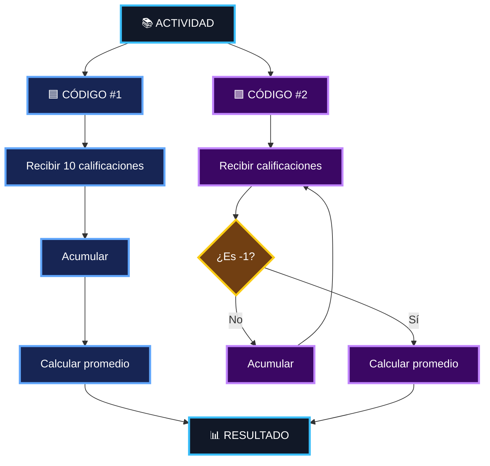

---

# 10. Capturas de Pantalla

## Código #1

### Ejecución

<div align="center">

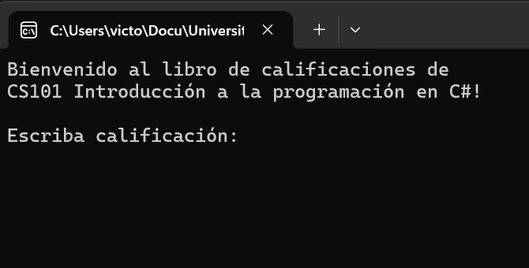

</div>

### Ingreso de Calificaciones

<div align="center">

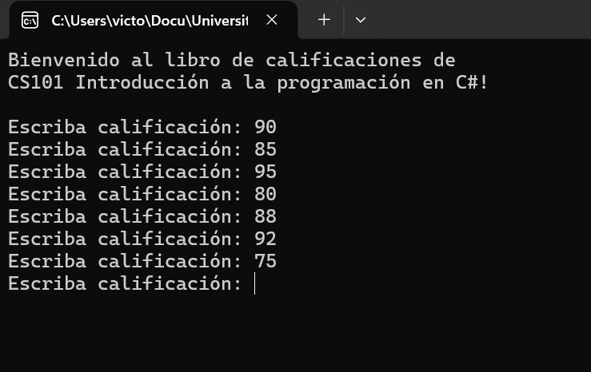

</div>

### Resultado

<div align="center">

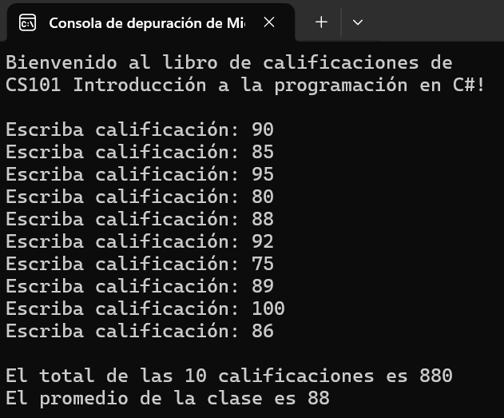

</div>

---

## Código #2

<div align="center">

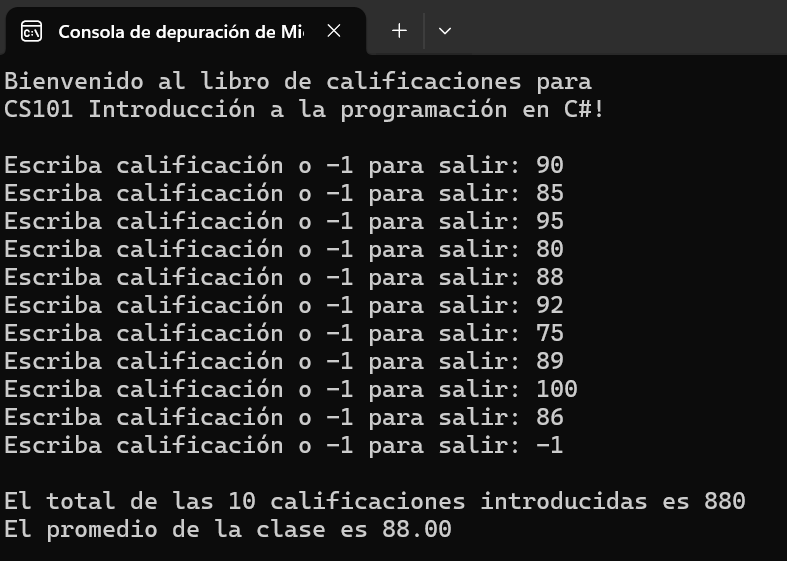

</div>

---

# 11. Tecnologías Utilizadas

<div align="center">


</div>

---

# 12. Cómo Ejecutar los Proyectos

Cada solución es independiente.

## Código #1

Abrir:

```text
Codigo#1 - Victor Montes/
└── Codigo#1 - Victor Montes.slnx
```

Posteriormente ejecutar el proyecto desde **Visual Studio**.

---

## Código #2

Abrir:

```text
Codigo#2 - Victor Montes/
└── Codigo#2 - Victor Montes.slnx
```

Posteriormente ejecutar el proyecto desde **Visual Studio**.

---

# 13. Estructura Completa del Repositorio

```text
Actividad-C-SHARP-Libreta-de-Calificaciones-Hojas-Impresas/
│
├── 📄 README.md
│
├── 📁 assets/
│   ├── banner-libretacalificaciones-csharp.jpg
│   ├── actividad-ejecucion.png
│   ├── actividad-calificaciones.png
│   ├── actividad-resultado.png
│   └── actividad-codigo2.png
│
├── 🟦 Codigo#1 - Victor Montes/
│   │
│   ├── Codigo#1 - Victor Montes.slnx
│   │
│   └── Codigo#1 - Victor Montes/
│       ├── Program.cs
│       ├── Class1.cs
│       └── Codigo#1 - Victor Montes.csproj
│
└── 🟪 Codigo#2 - Victor Montes/
    │
    ├── Codigo#2 - Victor Montes.slnx
    │
    └── Codigo#2 - Victor Montes/
        ├── Program.cs
        ├── Class1.cs
        └── Codigo#2 - Victor Montes.csproj
```

---

# 14. Conclusión

Esta actividad presenta **dos soluciones al problema de una libreta de calificaciones**.

El **Código #1** demuestra cómo utilizar un ciclo `while` controlado mediante un contador cuando se conoce previamente la cantidad de datos que deben introducirse.

El **Código #2** demuestra el uso de un **valor centinela**, permitiendo que el usuario determine cuándo finalizar la entrada de datos.

Ambos proyectos permiten practicar conceptos fundamentales de C#, como:

* Clases
* Objetos
* Constructores
* Propiedades
* Métodos
* Encapsulamiento
* Ciclo `while`
* Condicionales
* Contadores
* Acumuladores
* Conversión de datos
* Valores centinela
* Cálculo de promedios

---

<div align="center">

### 🧑‍💻 Victor Montes

**Universidad Tecnológica de Panamá — UTP**
**Facultad de Ingeniería de Sistemas Computacionales — FISC**

<br>

⭐ **Actividad académica desarrollada en C# y .NET**

</div>
